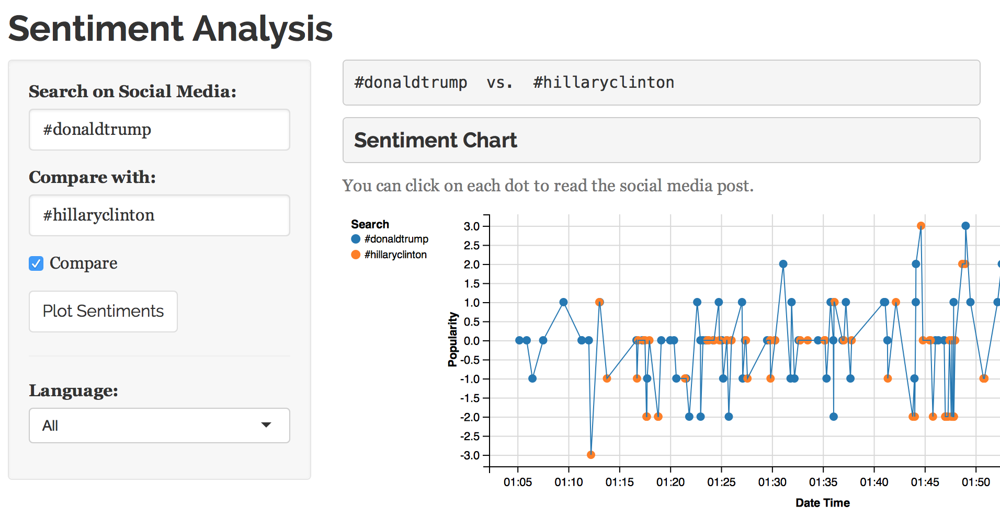
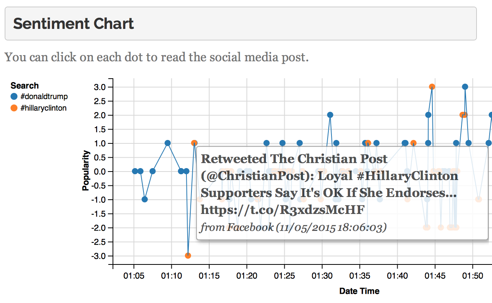
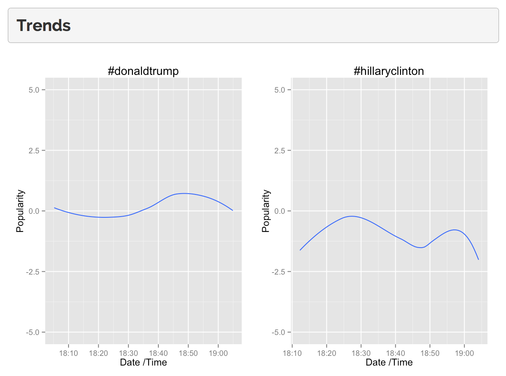

## TweetyFeely

TweetyFeely is a Shiny app that allows you to read the positive and negative tweets about any topic, the popularity trend and sources of such tweets.

It uses the [twitteR](https://github.com/geoffjentry/twitteR) R package to connect to the micro-blogging service.

This little app got me a job as an NLP engineer. The idea was to write a quick prototype in 20 minutes or less, as part of the interview.

Here are some of the recent screenshots of the app:

### Sentiment Dashboard

### Click to read a tweet

### Sentiment Trends

We can see on this screenshot that (at the moment this analysis) Donald Trump is trending more positively than Hillary Clinton 

